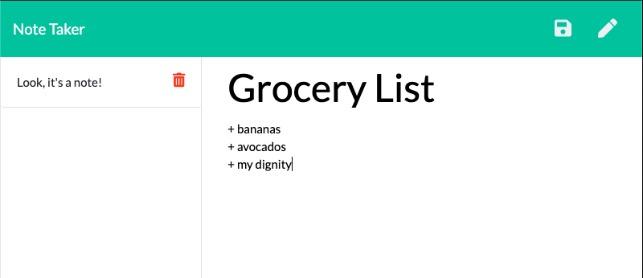

# notetakr

## Description
A notetaking app built with an express.js back end.

## Installation and Usage
click [here](https://arcane-wave-64105.herokuapp.com/) to go to the Note Taker and play with the basic functionality.

If you don't want to do that, see the below screenshot for what the app looks like.

**Note:** 
This application is still in development. Check the [issues tab](https://github.com/rawagschal/notetakr/issues) to see what I'm working on.

## Support
For questions, concerns, comments, please [email me](mailto:rawagschal@gmail.com)

## License
[MIT](https://opensource.org/licenses/MIT)
